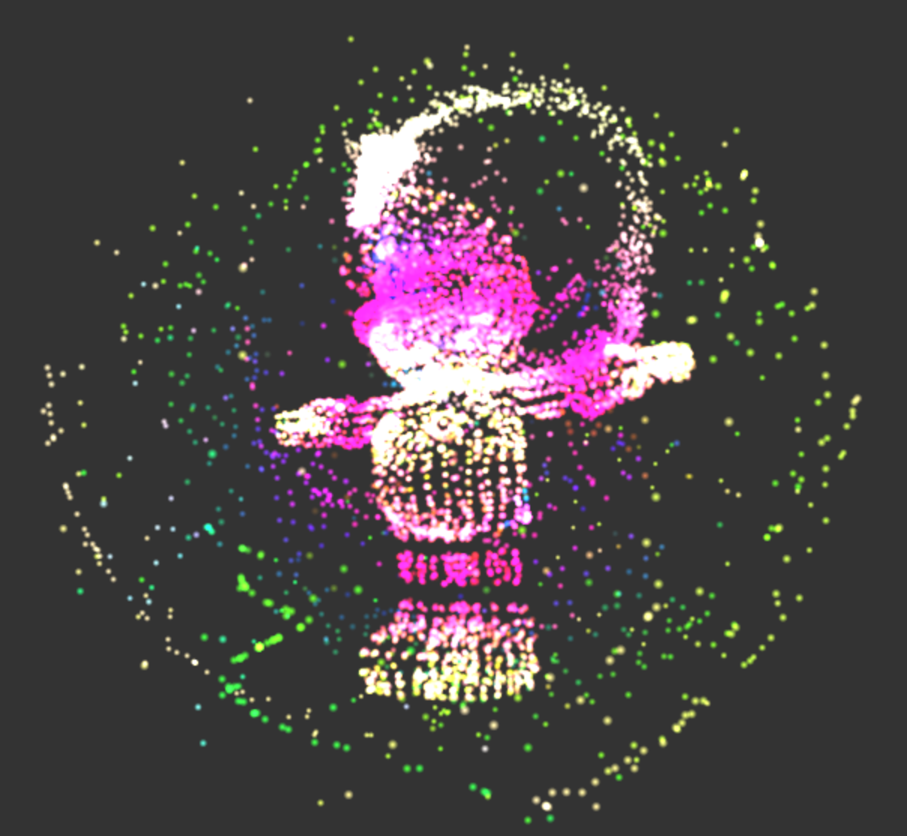
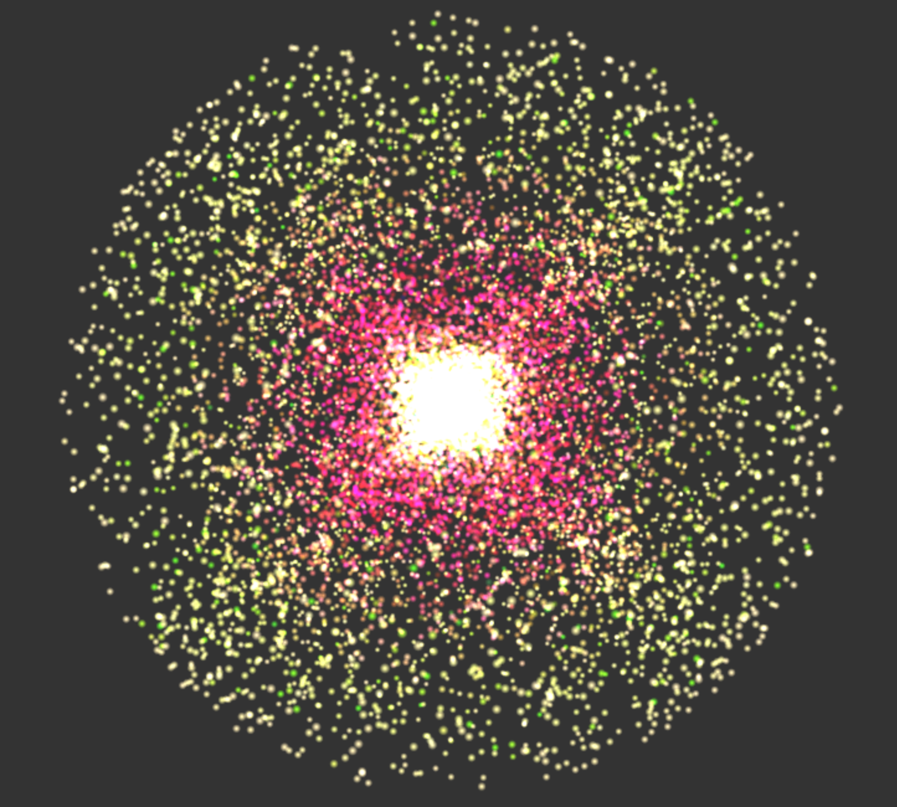
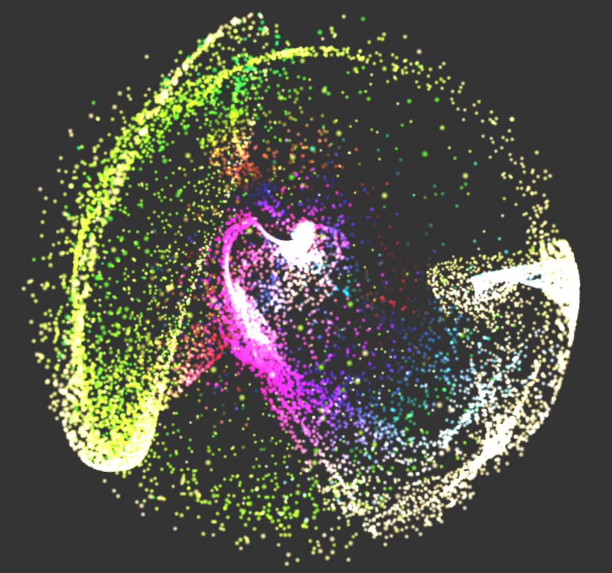
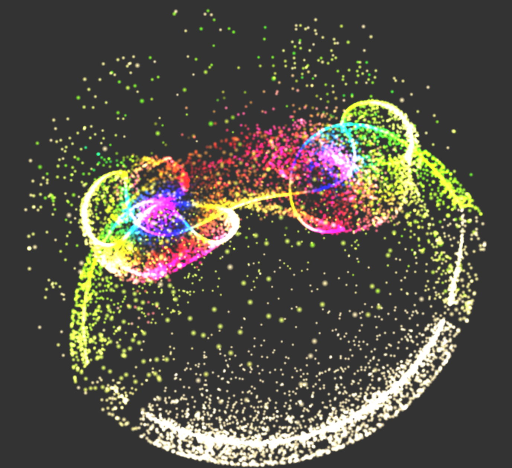
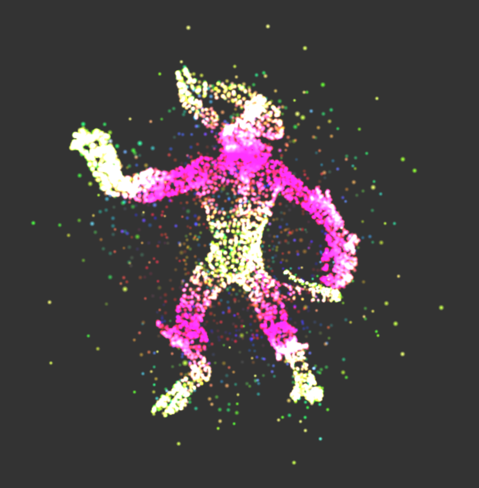

# Project 6: Particle System - Crystal Ball
By Joshua Nadel

https://bobmowzie.github.io/homework-6-particle-system-BobMowzie-forked/

#Particle collection

The scene uses instanced rendering to depict 20000 particles moving within a spherical boundary. Particle motion is calculated using simple Euler integration by determining the acceleration each particle receives from all point influencers in the scene. To reduce instability at small distances, the force that an influencer can induce on a particle is capped proportionally to its strength. Particles are colored according to a cosine color palette. The r and b channels are selected by speed while the g channel is selected by distance from the center. Particles are randomly initialized in a cube volume and distributed by a point attractor in the center.

#Interaction

By switching to Interact mode, users can click and drag to influence the particles with the mouse cursor. Left clicking will attract particles, while right clicking will repel them. The property "interactStrength" determines the intensity of the effect. While attracting particles, particle speeds are multiplied by a factor proportional to their distance to the mouse pointer. This slows particles down as they approach the cursor, which gives the user more control over the particle movement.

In Place mode, users can click to place influencers in the scene. Left clicking will place attractors, while right clicking will place repellers. The property "interactStrength" determines the intensity of the inducers. Clicking "Clear Inducers" removes all placed inducers.

#Mesh Attraction

Users can select a mesh to attract particles to. One particle will move to each vertex of the selected mesh to form an approximation of its surface. Particle speeds are multiplied by a factor proportional to their distance to their corresponding vertex to reduce chaotic behavior and better enable mesh attraction.

Combine these effects to predict your future!

Mouse input code reference: http://www.typescriptgames.com/MouseInput.html

Demon model from: https://gumroad.com/truongcgartist

Ray tracing code: https://www.scratchapixel.com/code.php?id=3&origin=/lessons/3d-basic-rendering/introduction-to-ray-tracing